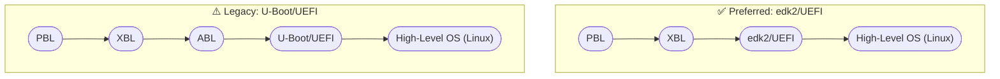

# qcom-tool

`qcom-ptool` contains various device partitioning utilities like `ptool.py`, `gen_partitions.py` and various sample partition configuration files needed for Qualcomm SoCs. Qualcomm Linux currently could be build for the follow reference Linux based OSes:

- Yocto with [meta-qcom](https://github.com/qualcomm-linux/meta-qcom)
- debos Debian based with [qcom-deb-images](https://github.com/qualcomm-linux/qcom-deb-images)
- Gaia DeimOS Debian based with [cookbook-qcom](https://github.com/gaiaBuildSystem/cookbook-qcom)

These references use `qcom-ptool` to generate partition table layouts. The partition GUIDs, names and size budgets are picked to support boot flows as follows:

# Development

See [CONTRIBUTING.md file](CONTRIBUTING.md) for instructions on how to send
code contributions to this project. You can also [report an issue on
GitHub](../../issues).

# Maintainer(s)

See [CODEOWNERS](.github/CODEOWNERS).

# License

This project is licensed under the [BSD-3-clause
License](https://spdx.org/licenses/BSD-3-Clause.html). See
[LICENSE](LICENSE) for the full license text.
